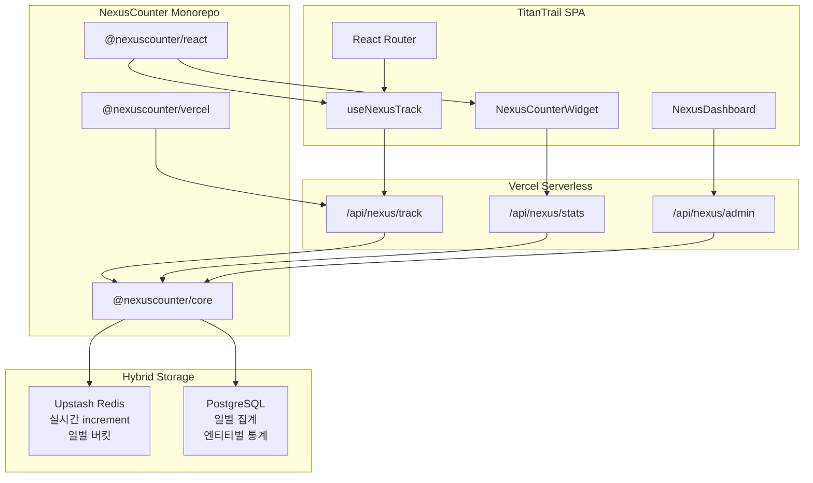

# NexusCounter 모듈 구현 계획

## 현재 상황

| 항목 | 상태 |
|------|------|
| 워크스페이스 [`/Users/jmac/Desktop/nextai-260619-next-view-couter-module`](/Users/jmac/Desktop/nextai-260619-next-view-couter-module) | **비어 있음** (greenfield) |
| 적용 대상 [TitanTrail](https://titantrail.vercel.app/) | Vite 6 + React Router 6 + Vercel Serverless + Prisma(PostgreSQL) + Upstash Redis |
| 기존 조회수 | `ReportEngagement.views` — **리포트 engagement 전용**, 사이트/페이지 트래픽과 별개 유지 |
| 참조 구현 | [comics-agent `analytics.ts`](/Users/jmac/Desktop/NXP%202026%20DEV/nextai-260606-comics-agent-v1/lib/server/analytics.ts), [WordPress Post Views Counter](https://wordpress.org/plugins/post-views-counter/) |

## 아키텍처 개요



## Monorepo 구조

```
nextai-260619-next-view-couter-module/
├── package.json                 # npm workspaces
├── packages/
│   ├── core/                    # @nexuscounter/core
│   │   ├── src/
│   │   │   ├── types.ts         # NexusConfig, EntityType, ViewTarget
│   │   │   ├── classifier.ts    # User-Agent → entity 분류
│   │   │   ├── storage/
│   │   │   │   ├── redis.ts     # increment, daily bucket
│   │   │   │   └── postgres.ts  # rollup, query
│   │   │   ├── tracker.ts       # trackView(), getStats()
│   │   │   └── config.ts        # displayMode, excludeRules
│   │   └── package.json
│   ├── react/                   # @nexuscounter/react
│   │   ├── src/
│   │   │   ├── NexusProvider.tsx
│   │   │   ├── useNexusTrack.ts
│   │   │   ├── NexusCounterWidget.tsx   # 누적 방문자 수
│   │   │   └── NexusTrendChart.tsx      # Recharts 라인 그래프
│   │   └── package.json
│   └── vercel/                  # @nexuscounter/vercel
│       ├── src/
│       │   ├── createTrackHandler.ts
│       │   ├── createStatsHandler.ts
│       │   └── createAdminHandler.ts
│       └── package.json
└── examples/
    └── titantrail-integration.md  # TitanTrail 적용 가이드
```

## 엔티티 분류 (SEO / AEO / GEO)

[`packages/core/src/classifier.ts`](packages/core/src/classifier.ts)에서 `User-Agent` 기반 분류:

| EntityType | 대상 | 예시 UA |
|------------|------|---------|
| `human` | 일반 사용자 | 브라우저 기본 UA |
| `search_bot` | SEO 크롤러 | Googlebot, Bingbot, YandexBot |
| `agent_bot` | AEO/GEO AI 에이전트 | GPTBot, ClaudeBot, PerplexityBot, Applebot-Extended |
| `preview_bot` | SNS/미리보기 | facebookexternalhit, Twitterbot |
| `unknown` | 미분류 | — |

- **기본 집계**: `human` only (WordPress 플러그인의 "Exclude bots"와 동일)
- **대시보드**: 전체 엔티티별 breakdown 표시
- MVP에서는 분류 없이 전체 카운트 → Phase 1에서 활성화

## 데이터 모델

### Redis (실시간, Phase MVP~)

```
nexus:site:total:{entityType}          → 누적 사이트 조회수
nexus:daily:{YYYY-MM-DD}:{entityType}  → 일별 합계 (트렌드용)
nexus:path:{pathHash}:{entityType}     → 페이지별 조회수
nexus:content:{type}:{slug}:{entity}   → 콘텐츠(포스트)별 조회수
```

### PostgreSQL (TitanTrail Prisma 확장, Phase 1~)

TitanTrail [`prisma/schema.prisma`](/Users/jmac/Desktop/NXP%202026%20DEV/nextai-260523-titantrail/prisma/schema.prisma)에 추가:

```prisma
model NexusViewDaily {
  id         String   @id @default(cuid())
  date       DateTime @db.Date
  path       String   @default("/")
  entityType String   // human | search_bot | agent_bot | preview_bot | unknown
  views      Int      @default(0)
  @@unique([date, path, entityType])
  @@index([date])
}

model NexusContentView {
  id          String @id @default(cuid())
  contentType String // page | report | macro | news
  contentKey  String // slug or path
  entityType  String
  views       Int    @default(0)
  @@unique([contentType, contentKey, entityType])
}
```

- Redis → PostgreSQL **일별 rollup**: Vercel Cron (`0 1 * * *`) 또는 track 시 비동기 flush
- TitanTrail 기존 Redis 클라이언트 [`src/lib/cache/redis.ts`](/Users/jmac/Desktop/NXP%202026%20DEV/nextai-260523-titantrail/src/lib/cache/redis.ts) 패턴 재사용

## 단계별 기능 (MVP → Phase 3)

### MVP — 핵심 카운터 + 표시

WordPress 플러그인 핵심([post-views-counter](https://wordpress.org/plugins/post-views-counter/)) 대응:

- **페이지 뷰**: SPA 라우트 변경 시 `path` 기록
- **포스트/콘텐츠 뷰**: `contentType` + `contentKey` (예: `report:apple-10k`)
- **중복 방지**: `sessionStorage` 키 (`nexus:view:{path}`), comics-agent [`useViewTracking.ts`](/Users/jmac/Desktop/NXP%202026%20DEV/nextai-260606-comics-agent-v1/hooks/useViewTracking.ts) 패턴
- **API**: `POST /api/nexus/track`, `GET /api/nexus/stats`
- **표시 설정** (`NexusConfig.displayMode`):

| 값 | 동작 |
|----|------|
| `off` | UI 숨김, 백그라운드 수집만 |
| `landing` | [`Landing.tsx`](/Users/jmac/Desktop/NXP%202026%20DEV/nextai-260523-titantrail/src/pages/Landing.tsx) 하단 stats 섹션에 누적 방문자 + 트렌드 |
| `header` | [`Layout.tsx`](/Users/jmac/Desktop/NXP%202026%20DEV/nextai-260523-titantrail/src/components/Layout.tsx) 헤더에 compact 카운터 |
| `footer` | Layout 푸터에 compact 카운터 |

- **UI 컴포넌트**: `NexusCounterWidget` (Eye 아이콘 + 포맷된 숫자, comics-agent [`ViewCounter.tsx`](/Users/jmac/Desktop/NXP%202026%20DEV/nextai-260606-comics-agent-v1/components/layout/ViewCounter.tsx) 스타일)

### Phase 1 — 엔티티 구분 + 트렌드

- User-Agent 분류기 활성화, `excludeEntities` 설정 (기본: 봇 제외)
- `NexusTrendChart`: Recharts `LineChart`, 최근 7/30일 일별 human views
- Redis daily bucket → PostgreSQL `NexusViewDaily` rollup
- TitanTrail 기존 `stats.totalViews`(ReportEngagement 합계)와 **병렬 표시** — 라벨 구분 (`Site Views` vs `Report Reads`)

### Phase 2 — 트래픽 대시보드

- **Admin 페이지**: `/admin/traffic` (editor role gate — TitanTrail [`editorGate.ts`](/Users/jmac/Desktop/NXP%202026%20DEV/nextai-260523-titantrail/src/lib/auth/editorGate.ts) 패턴)
- **패널 구성**:
  - KPI 카드: 오늘/7일/30일/전체 human views
  - 엔티티 breakdown (human vs search_bot vs agent_bot)
  - Top Pages 테이블 (path별)
  - Top Content 테이블 (report/macro/news slug별)
  - 일별 트렌드 라인 차트
- **수동 조정 API**: `PATCH /api/nexus/admin/adjust` (WordPress "Manually adjust views")
- **기간 필터**: 7 / 30 / 90 / all

### Phase 3 — 고도화

- CSV/JSON export (`GET /api/nexus/admin/export`)
- Count interval 설정 (동일 세션 N분 내 재카운트 방지 — server-side IP+path dedup)
- `@nexuscounter/next` 어댑터 (Next.js App Router)
- 콘텐츠 views 기준 정렬 API (`GET /api/nexus/content/ranked`)
- 멀티 사이트 `siteId` 지원 (향후 다른 Node.js 앱 재사용)

## TitanTrail 통합 포인트

### 1. API 라우트 추가 (TitanTrail `api/`)

```
api/nexus/track.ts    → createTrackHandler({ redis, prisma })
api/nexus/stats.ts    → createStatsHandler({ redis, prisma })
api/nexus/admin.ts    → createAdminHandler({ redis, prisma, auth: editorGate })
```

[`api/reports/index.ts`](/Users/jmac/Desktop/NXP%202026%20DEV/nextai-260523-titantrail/api/reports/index.ts)와 동일한 Vercel handler 패턴.

### 2. 클라이언트 연동

```tsx
// App.tsx — 라우트 변경 추적
<NexusProvider config={{ apiBase: '/api/nexus', displayMode: 'landing' }}>
  <NexusRouteTracker />  {/* useLocation → track page view */}
  <Routes>...</Routes>
</NexusProvider>

// Layout.tsx — displayMode === 'header' | 'footer' 시 NexusCounterWidget
// Landing.tsx — displayMode === 'landing' 시 NexusCounterWidget + NexusTrendChart
// Report.tsx — contentType: 'report', contentKey: slug 추가 track
```

### 3. 환경 변수 (TitanTrail `.env`)

```
NEXUS_ENABLED=true
NEXUS_DISPLAY_MODE=landing        # off | landing | header | footer
NEXUS_EXCLUDE_BOTS=true
NEXUS_COUNT_INTERVAL_MINUTES=0    # Phase 3
```

기존 `UPSTASH_REDIS_*`, `DATABASE_URL` 재사용.

### 4. dev-server 연동

TitanTrail [`server/dev-server.ts`](/Users/jmac/Desktop/NXP%202026%20DEV/nextai-260523-titantrail/server/dev-server.ts)에 `/api/nexus/*` 라우트 등록.

## 핵심 API 스펙

**POST `/api/nexus/track`**
```json
{
  "target": "page" | "content",
  "path": "/audit/apple-10k",
  "contentType": "report",
  "contentKey": "apple-10k"
}
```
→ Response: `{ "ok": true }` (UA는 서버에서 `req.headers['user-agent']`로 분류)

**GET `/api/nexus/stats?period=7&entity=human`**
```json
{
  "totalViews": 12450,
  "todayViews": 128,
  "trend": [{ "date": "2026-06-13", "views": 95 }, ...]
}
```

## 구현 순서

1. Monorepo 스캐폴딩 + `@nexuscounter/core` (Redis tracker, config)
2. `@nexuscounter/vercel` handler factory
3. `@nexuscounter/react` (Provider, hook, widget)
4. TitanTrail API + Prisma schema + 클라이언트 통합 (**MVP 완료 — 배포 가능**)
5. Entity classifier + PostgreSQL rollup + trend chart (**Phase 1**)
6. Admin dashboard + adjust API (**Phase 2**)
7. Export, interval, Next.js adapter (**Phase 3**)

## 주의사항

- **기존 `ReportEngagement.views`와 통합하지 않음** — NexusCounter는 사이트 트래픽, ReportEngagement는 콘텐츠 engagement(like/download/share 포함). Report 페이지에서는 두 카운터 모두 fire 가능 (page view + content view).
- **SPA 특성**: 서버 middleware 불가 → 클라이언트 `useLocation` + API track이 WordPress JS counting mode에 해당.
- **Redis 미설정 시**: comics-agent와 동일하게 in-memory fallback (dev/local), production에서는 Upstash 필수.
- **Recharts**: TitanTrail에 이미 포함 — `@nexuscounter/react`에서 peer dependency로 선언.

## 성공 기준

- MVP: TitanTrail 모든 페이지 방문 시 Redis 카운트 증가, Landing 또는 Header/Footer에 누적 방문자 표시
- Phase 1: human vs bot 분리, 7일 트렌드 라인 그래프 Landing 표시
- Phase 2: Editor 로그인 후 `/admin/traffic`에서 페이지/엔티티별 통계 확인
- Phase 3: CSV export + 다른 Next.js 앱에 `@nexuscounter/next`로 30분 내 적용 가능
